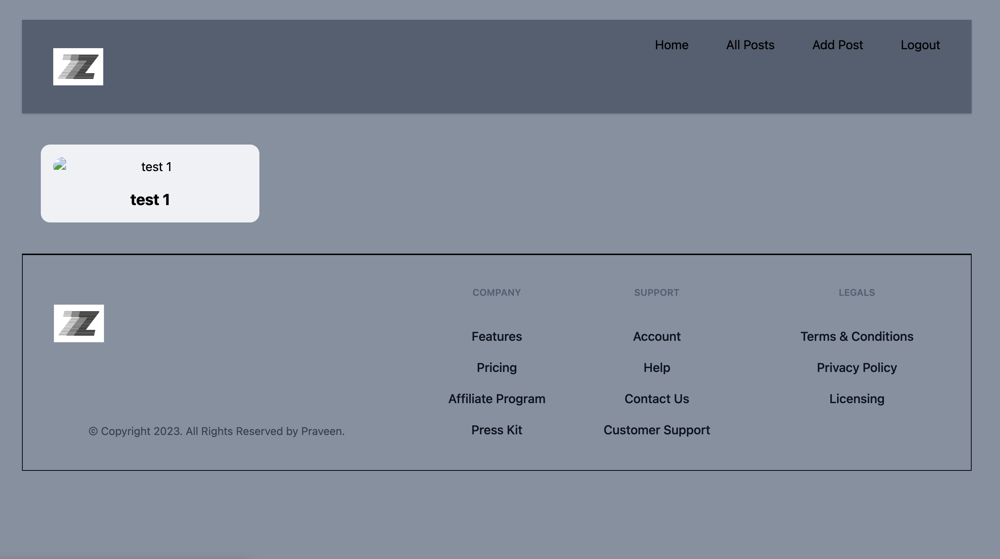

# Zentry — Production-Grade Blogging Platform

**Zentry** is a production-grade blogging web application built using **React.js** and **Appwrite**. Designed for modern content creators and developers, Zentry offers high performance, secure content management, real-time editing capabilities, and a clean, responsive user interface.

Built with scalability, modularity, and industry best practices in mind.

---

## Tech Stack

- **Frontend:** React.js (Vite)
- **State Management:** Redux Toolkit
- **Backend as a Service:** Appwrite (Authentication, Database, Storage)
- **Form Handling:** React Hook Form (`useForm`, `Controller`)
- **Rich Text Editor:** TinyMCE
- **HTML Rendering:** `html-react-parser`
- **Advanced React Patterns:** `forwardRef`, controlled components

---

## Key Features

- Secure authentication and user authorization using Appwrite
- Real-time WYSIWYG rich text editing with TinyMCE
- Full CRUD functionality for blog posts
- HTML parsing to render content accurately from the editor
- Persistent and predictable global state using Redux Toolkit
- Custom form handling with validation using `react-hook-form`
- Use of advanced React techniques such as:
  - `forwardRef` for reusable component control
  - `Controller` for integrating controlled components into forms
- Image uploads and previews via Appwrite Storage
- Slug-based dynamic routing for SEO-friendly URLs
- Fully responsive, accessible, and modern user interface

---

## Preview

---

## Learnings and Highlights

Zentry is built with production-level architecture and advanced development patterns:

- Seamless integration of Appwrite’s SDK for authentication, database, and storage
- Complex form logic handled using `Controller` and rich text editors
- Efficient state flow using Redux Toolkit with slices and async thunks
- Use of `forwardRef` for granular control of deeply nested UI components
- Secure file handling and rendering logic for dynamic image previews

---

## Contributing

Contributions are welcome. Feel free to open issues or submit pull requests to help improve the platform.

---

## License

This project is licensed under the MIT License.
